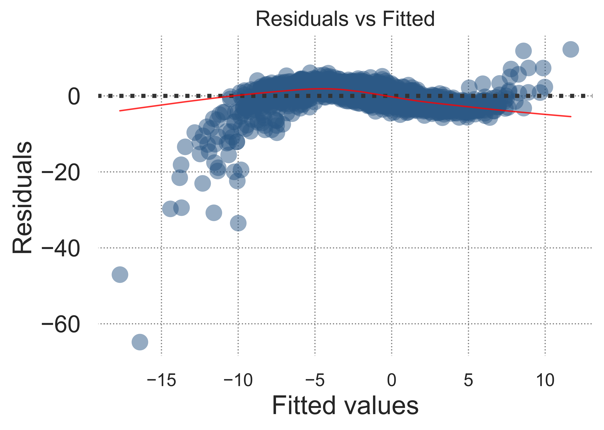

# matplotlib-stylin
A stylesheet for matplotlib: has big axis labels, and a blue color scheme

## About the files in this directory

There are three files, a stylesheet with a `.mplstyle` extension, a csv, and a jupyter notebook.

To use the style sheet you must fork or clone this repo and move the mplstyle sheet into your local computer's mpl styles folder.

[Visit here for a walkthrough](https://pythonprogramming.net/styles-matplotlib-tutorial/)

You can play around with the styling however you want from there. The stylesheet as I've set it up will produce a graph that 
looks like this:

